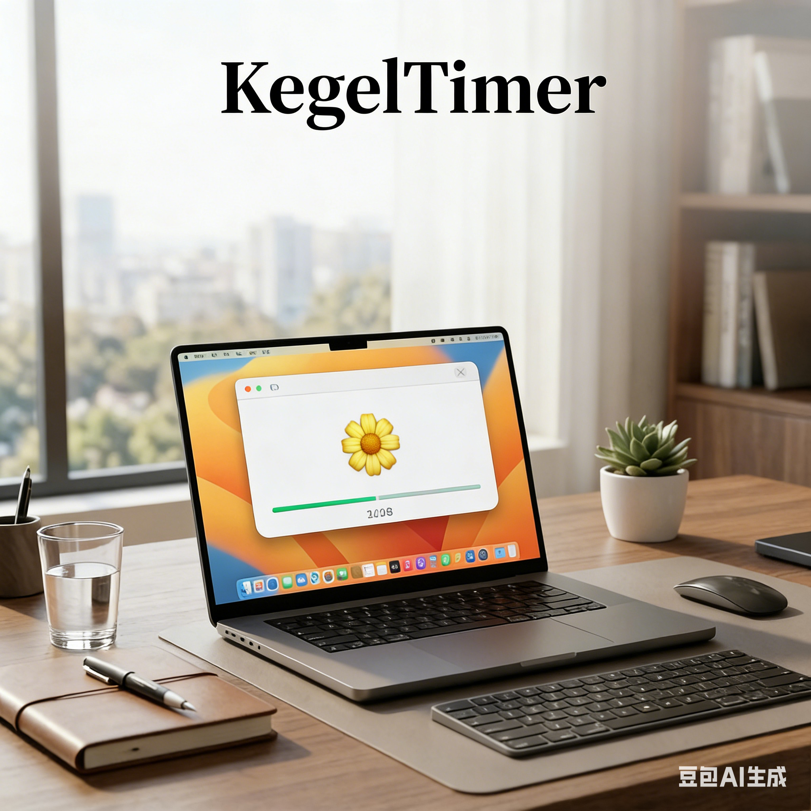

# KegelTimer

**macOS 提肛运动计时器 · 定时提醒 · 隐私优先**

[English](README_EN.md) | [日本語](README_JP.md)



## 简介

KegelTimer 是一款极简的 macOS 菜单栏应用，帮助你养成定时做提肛运动的习惯。

- ⏰ **定时提醒**：自定义提醒间隔，到点自动弹出
- 🌻 **动态交互**：跟随葵花动画进行收缩与放松
- 📊 **平滑进度**：全新的分段式进度条，实时掌控训练节奏
- 🚀 **极速启动**：点击即刻开始，无多余等待
- 🔒 **隐私优先**：无需账号、无数据收集、完全本地运行
- 💻 **原生支持**：专为 Apple Silicon (M1/M2/M3) 优化

---

## 快速开始

### 1. 下载安装

前往 [GitHub Releases](https://github.com/section9-lab/Kegel/releases/latest) 下载最新的 `KegelTimer-AppleSilicon.zip`，解压后将 `KegelTimer.app` 拖入 `/Applications` 文件夹即可。

### 2. 核心操作

1. **开启提醒**：启动应用后，菜单栏会出现 🌼 图标。
2. **自定义设置**：点击图标 → **设置...** (⌘,) 调整提醒间隔、收缩/放松时长及循环次数。
3. **开始训练**：等待提醒弹出，或随时点击菜单栏的 **开始/暂停**。

---

## 功能亮点

### 交互式悬浮窗

- **智能悬停**：关闭按钮在鼠标靠近时自动显现，平时保持简洁。
- **实时倒计时**：悬浮窗内实时显示当前动作剩余秒数。
- **状态卡片**：精致的“下次提醒”胶囊标签，支持动态缩放动画。

### 进化版进度条

- **阶段平分**：每组动作被平分为收缩与放松两个半场。
- **一致性增长**：无论是收缩还是放松，进度条均从左向右平滑填满，符合直觉。

---

## 设置参数详解

| 选项 | 范围 | 说明 |
|------|------|------|
| **提醒间隔** | 5-240 分钟 | 两次训练之间的休息时间 |
| **收缩时长** | 1-15 秒 | 每次肌肉收缩保持的时间 |
| **放松时长** | 1-15 秒 | 每次收缩后的休息时间 |
| **训练次数** | 5-50 次 | 每一轮训练包含的重复组数 |

---

## 常见问题

### Q: 支持 Intel 处理器吗？
A: 当前 Release 版本主要针对 Apple Silicon (M-series) 优化。Intel 用户可以通过源码自行编译。

### Q: 为什么点击开始后直接进入训练？
A: 为了提高效率，我们移除了旧版本的准备倒计时。点击即开始，建议提前做好准备。

### Q: 数据安全性如何？
A: 应用完全本地运行，所有配置均存储在系统的 `UserDefaults` 中，不联网，不上传。

---

## 技术规格

- **语言**: Swift 6.0
- **框架**: SwiftUI + AppKit
- **架构**: 响应式状态管理 (Combine + @MainActor)
- **部署**: GitHub Actions 自动化流水线

---

## 开发者指南

如果你想自行编译或贡献代码：

```bash
git clone https://github.com/section9-lab/Kegel.git
cd Kegel

# 使用本地脚本一键打包
bash scripts/package.sh

# 打包后的产物位于
dist/KegelTimer.app
```

---

## 更新日志

### v1.0.0
- ✨ **流程重构**：移除准备倒计时，实现“即点即练”。
- 🎨 **UI 升级**：全新的悬浮窗设计，支持 Hover 交互及圆角优化。
- 📊 **算法优化**：重做进度条逻辑，支持阶段平分与一致性增长。
- ⚙️ **架构改进**：解决计时器并发安全问题，提升系统稳定性。
- 🤖 **CI/CD**：集成 GitHub Actions，实现 Apple Silicon 自动构建与发布。

---

## 许可证

本项目采用 [GNU General Public License v3.0](LICENSE) 开源。

---

## 社区与反馈

- [提交 Issue](https://github.com/section9-lab/Kegel/issues)
- [查看仓库](https://github.com/section9-lab/Kegel)
