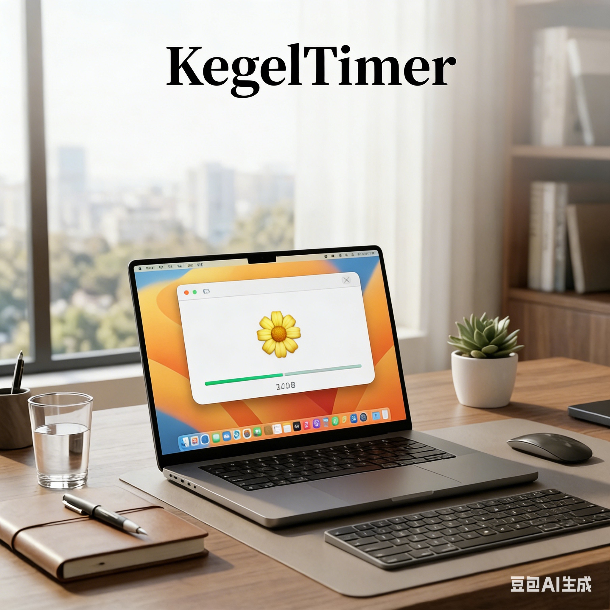

# KegelTimer

**macOS 用ケーゲル運動タイマー · タイムリーマインド · プライバシー優先**

[中文](README.md) | [English](README_EN.md)



## はじめに

KegelTimer は、スケジュール通りにケーゲル運動を行う習慣を作るための、ミニマルな macOS メニューバーアプリです。

- ⏰ **インテリジェントリマインダー**: カスタマイズ可能な間隔で自動ポップアップ通知。
- 🌻 **ダイナミックなインタラクション**: 花が開閉するアニメーションに合わせて収縮とリラックス。
- 📊 **スムーズな進捗**: 各セットを分割した新しいプログレスバーでトレーニング状況をリアルタイムに可視化。
- 🚀 **クイックスタート**: 準備なしですぐに開始 — 無駄な待機時間を排除。
- 🔒 **プライバシー優先**: アカウント不要、データ収集なし、完全ローカル動作。
- 💻 **ネイティブ対応**: Apple Silicon (M1/M2/M3) に完全最適化。

---

## クイックスタート

### 1. ダウンロードとインストール

[GitHub Releases](https://github.com/section9-lab/Kegel/releases/latest) から最新の `KegelTimer-AppleSilicon.zip` をダウンロードし、解凍した `KegelTimer.app` を `/Applications` フォルダにドラッグしてください。

### 2. 基本操作

1. **リマインダーを有効にする**: アプリを起動すると、メニューバーに 🌼 アイコンが表示されます。
2. **設定をカスタマイズ**: アイコンをクリック → **設定...** (⌘,) から間隔、時間、回数を調整します。
3. **トレーニング開始**: リマインダーを待つか、メニューバーの **開始/一時停止** をいつでもクリックしてください。

---

## 主な機能

### インタラクティブなフローティングウィンドウ

- **スマートホバー**: 閉じるボタンはマウスが近づいた時だけ表示され、普段はシンプルな外観を保ちます。
- **自動終了**: トレーニング完了後に「お疲れ様でした！」と表示し、3 秒後に自動でウィンドウを閉じます（作業の邪魔になりません）。
- **リアルタイムカウントダウン**: 現在のフェーズの残り秒数をウィンドウ内にリアルタイム表示。
- **ステータスバッジ**: スムーズなアニメーション付きの「次のリマインダー」カプセルタグ。

### 進化したプログレスバー

- **フェーズ分割**: 各レップは収縮とリラックスの 2 つの段階に均等に分割されます。
- **直感的な進捗**: どちらの段階でもプログレスバーは左から右へスムーズに溜まり、リズムを把握しやすくなっています。

---

## 設定パラメータの詳細

| オプション | 範囲 | 説明 |
|------------|------|------|
| **リマインダー間隔** | 5-240 分 | トレーニングセッション間の休憩時間 |
| **収縮時間** | 1-15 秒 | 筋肉を収縮させたまま保持する時間 |
| **リラックス時間** | 1-15 秒 | 収縮後の休憩時間 |
| **トレーニング回数** | 5-50 回 | 1 回のセッションで行うレップ数 |

---

## よくある質問

### Q: Intel プロセッサはサポートされていますか？
A: 現在のリリースは Apple Silicon (M-series) に最適化されています。Intel ユーザーはソースからビルドして使用できます。

### Q: なぜ開始後すぐにトレーニングが始まるのですか？
A: 効率向上のため、旧バージョンの準備カウントダウンを削除しました。準備を整えてから開始してください。

### Q: データの安全性について教えてください。
A: アプリは完全にローカルで動作します。すべての設定はシステム内の `UserDefaults` に保存され、ネットワーク送信やアップロードは一切行われません。

---

## 技術仕様

- **開発言語**: Swift 6.0
- **フレームワーク**: SwiftUI + AppKit
- **アーキテクチャ**: 反応型状態管理 (Combine + @MainActor)
- **デプロイ**: GitHub Actions による自動化パイプライン

---

## 開発者ガイド

自分でビルドまたは貢献する場合:

```bash
git clone https://github.com/section9-lab/Kegel.git
cd Kegel

# ローカルスクリプトで一括ビルド・パッケージング
bash scripts/package.sh

# 出力先
dist/KegelTimer.app
```

---

## 変更履歴

### v1.0.1
- 🚀 **スマート自動終了**: トレーニング完了の 3 秒後にウィンドウを自動で閉じる機能を追加。
- 🖼️ **アセット最適化**: スクリーンショットのサイズを最適化し、読み込み速度を向上。

### v1.0.0
- ✨ **フロー再構成**: 待機時間をなくし、「即座にトレーニング」を実現。
- 🎨 **UI 刷新**: 新しいフローティングデザイン、ホバーによるインタラクション、角丸の最適化。
- 📊 **アルゴリズム改善**: プログレスバーのロジックを刷新し、分割表示とスムーズな進捗を実現。
- ⚙️ **安定性向上**: タイマーの並行処理問題を解決し、システムの安定性を向上。
- 🤖 **CI/CD**: GitHub Actions を統合し、Apple Silicon 向けの自動ビルドとリリースを実装。

---

## ライセンス

このプロジェクトは [GNU General Public License v3.0](LICENSE) の下で公開されています。

---

## コミュニティ & フィードバック

- [Issue を作成](https://github.com/section9-lab/Kegel/issues)
- [リポジトリを見る](https://github.com/section9-lab/Kegel)
